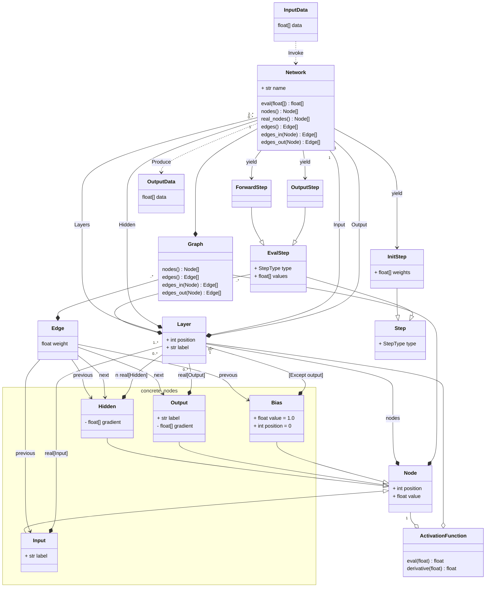
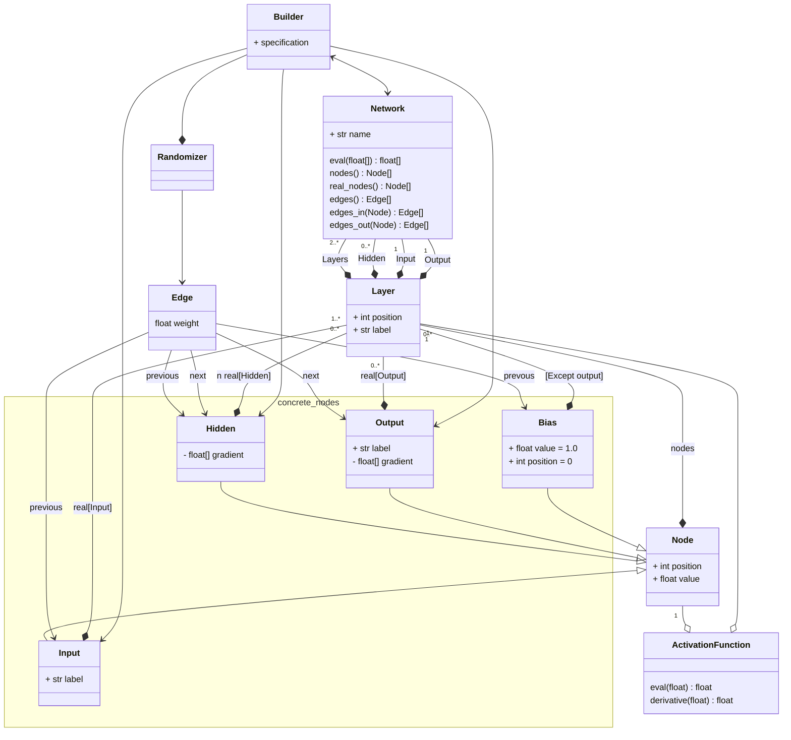
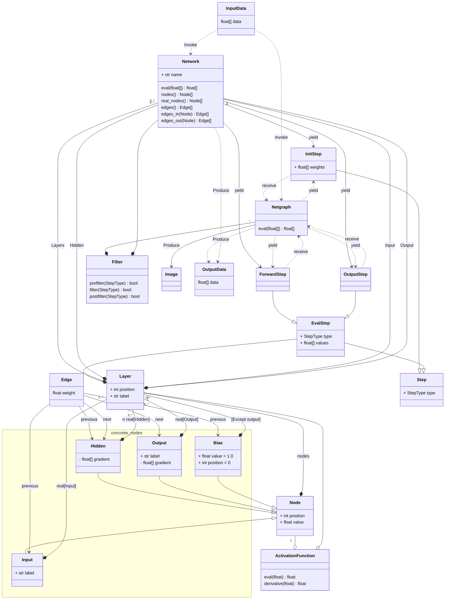
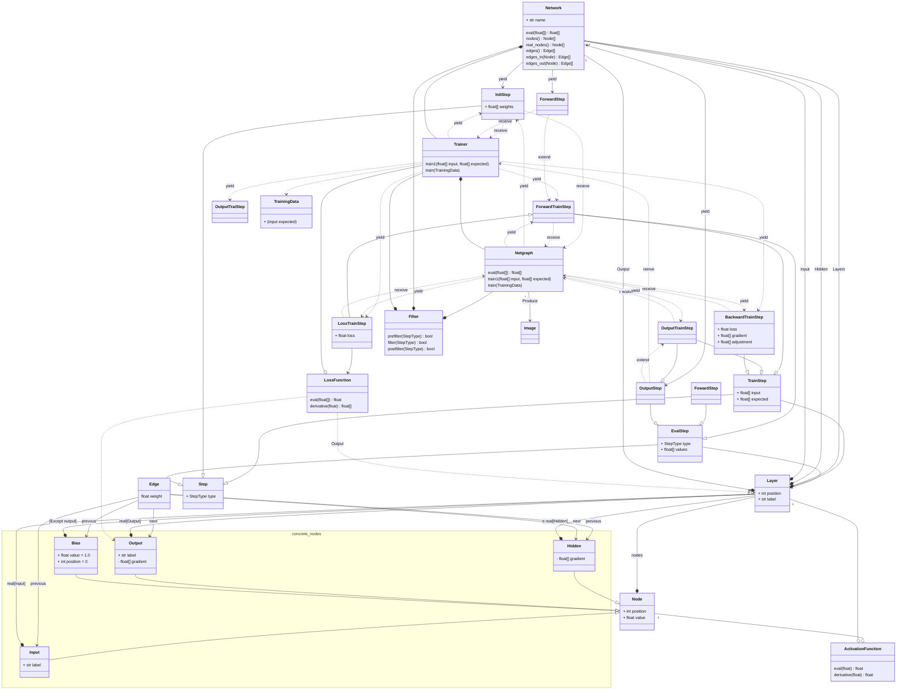
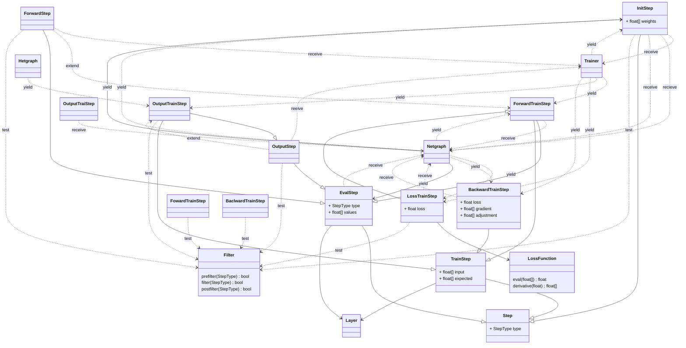
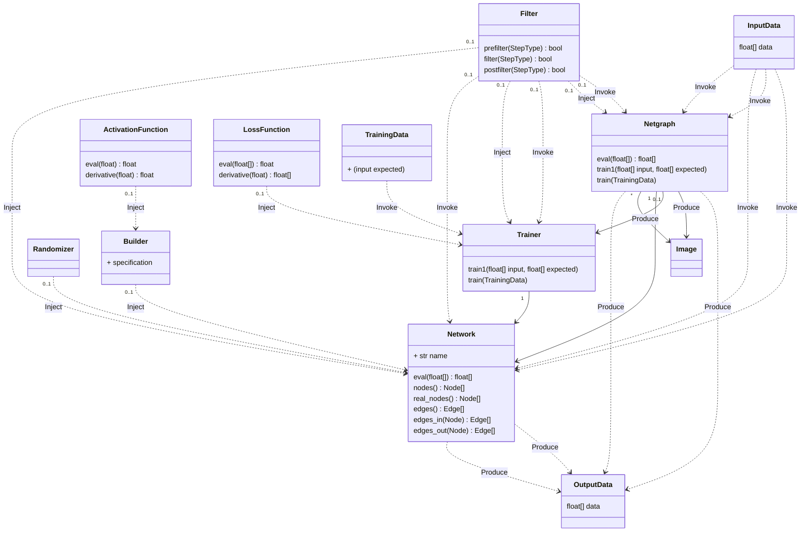

# Neural Network Diagram Generator

In support of my paper on AI and copyright, this generates a series of neural network diagrams, step-by-step.

Usage is illustrated in the [Jupyter notebook](notebooks/simple-nn.md).

Bias nodes are shown in a way which partially dissoaciates them from the layers. This is accomplished by shifting them halfway between layers, and using a distinctive appearance.

Layers are labeled and tagged with the activation function used in the layer

Nodes and edges are color-coded to reflect their values and weights, respectively. Blue is the most negative, red the most positive, passing through light grey at zero.

Networks are callable. The result is a generator, that on every call to `next()`, produces a new diagram for each step of the forward propagation. The value yielded is the label from the diagram, util the output stage is reached. The result from the output will be packaged as a tuple.

## Modularity

### Network

### Builder

### Netgraph

### Trainer + Netgraph

### Step-Centric View

The view of the StepResult objects and how they relate to each other and to the objects that send and recieve them.

### User View

Full set of user-level objects.

