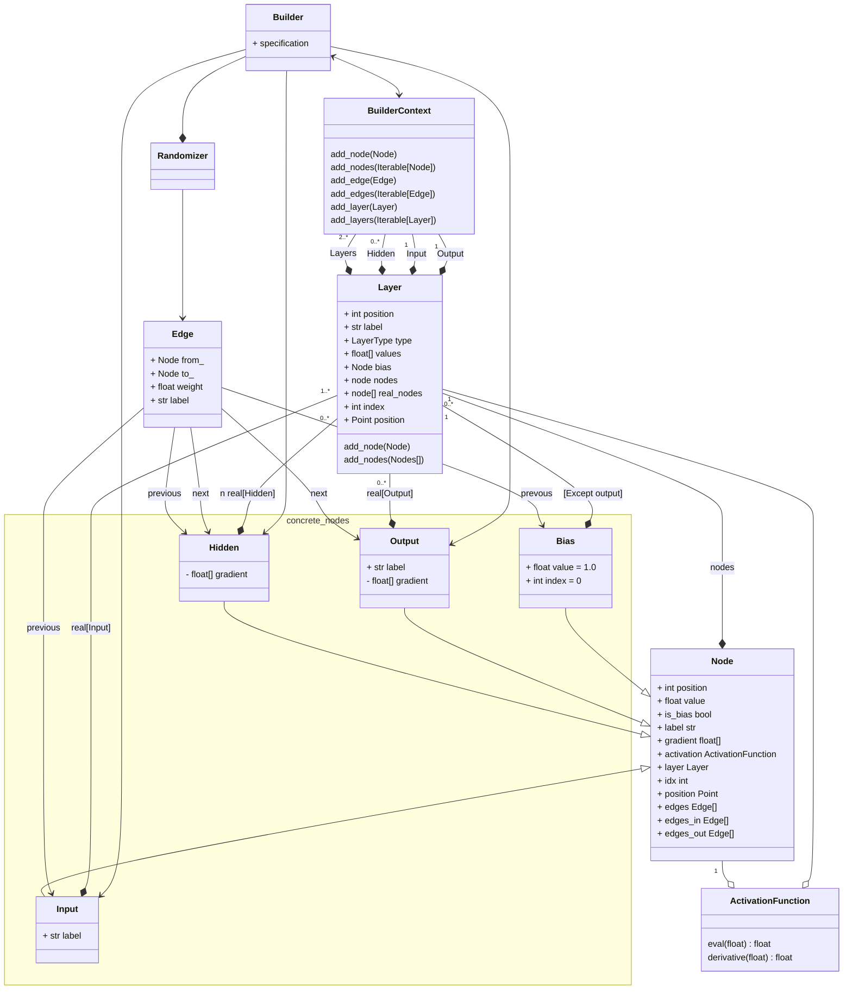

# Builder

```mermaid
classDiagram
  Node <|-- Input
  Hidden --|> Node
  Output --|> Node
  Bias --|> Node

  Edge --> Input : previous
  Edge --> Hidden : previous
  Edge --> Bias : prevous
  Edge --> Hidden : next
  Edge --> Output : next

  Layer "1" --* Bias : [Except output]
  Layer "1..*" --* Input : real[Input]
  Layer "0..*" --* Hidden : n real[Hidden]
  Layer "0..*" --* Output : real[Output]
  Layer "0..*" --* Node : nodes

  namespace concrete_nodes {
    class Bias {
        + float value = 1.0
        + int index = 0
    }
    class Output {
        + str label
        - float[] gradient
    }
    class Hidden {
        - float[] gradient
    }
    class Input {
        + str label
    }
  }
  class Node {
      + int position
      + float value
      + is_bias bool
      + label str
      + gradient float[]
      + activation ActivationFunction
      + layer Layer
      + idx int
      + position Point
      + edges Edge[]
      + edges_in Edge[]
      + edges_out Edge[]
  }


  class Edge {
    + Node from_
    + Node to_
    + float weight
    + str label
  }
  class Layer {
    + int position
    + str label
    + LayerType type
    + float[] values
    + Node bias
    + node nodes
    + node[] real_nodes
    + int index
    + Point position
    add_node(Node)
    add_nodes(Nodes[])
  }
  class ActivationFunction {
    eval(float) float
    derivative(float) float
  }
  class BuilderContext {
    add_node(Node)
    add_nodes(Iterable[Node])
    add_edge(Edge)
    add_edges(Iterable[Edge])
    add_layer(Layer)
    add_layers(Iterable[Layer])
  }
  Node "1" --o ActivationFunction
  Layer "1" --o ActivationFunction
  BuilderContext "2..*" --* Layer : Layers
  BuilderContext "0..*" --* Layer : Hidden
  BuilderContext "1" --* Layer : Input
  BuilderContext "1" --* Layer : Output

  BuilderContext
  Builder <--> BuilderContext
  Builder --> Input
  Builder --> Hidden
  Builder --> Output
  Builder --* Randomizer
  Randomizer --> Edge
  class Builder {
    + specification
  }
  class Randomizer {

  }
```
