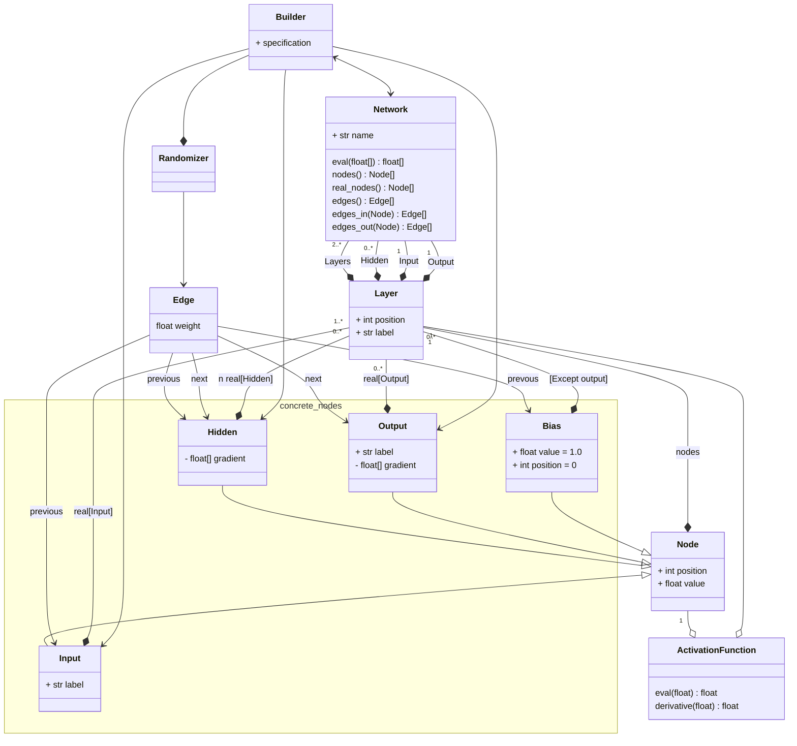

# Builder

```mermaid
classDiagram
  Node <|-- Input
  Hidden --|> Node
  Output --|> Node
  Bias --|> Node

  Edge --> Input : previous
  Edge --> Hidden : previous
  Edge --> Bias : prevous
  Edge --> Hidden : next
  Edge --> Output : next

  Layer "1" --* Bias : [Except output]
  Layer "1..*" --* Input : real[Input]
  Layer "0..*" --* Hidden : n real[Hidden]
  Layer "0..*" --* Output : real[Output]
  Layer "0..*" --* Node : nodes

  namespace concrete_nodes {
    class Bias {
        + float value = 1.0
        + int position = 0
    }
    class Output {
        + str label
        - float[] gradient
    }
    class Hidden {
        - float[] gradient
    }
    class Input {
        + str label
    }
  }
  class Node {
      + int position
      + float value
  }
  class Edge {
    float weight
  }
  class Layer {
    + int position
    + str label
  }
  class ActivationFunction {
    eval(float) float
    derivative(float) float
  }
  class Network {
    + str name
    eval(float[]) float[]
    nodes() Node[]
    real_nodes() Node[]
    edges() Edge[]
    edges_in(Node) Edge[]
    edges_out(Node) Edge[]
  }
  Node "1" --o ActivationFunction
  Layer "1" --o ActivationFunction
  Network "2..*" --* Layer : Layers
  Network "0..*" --* Layer : Hidden
  Network "1" --* Layer : Input
  Network "1" --* Layer : Output

  Builder <--> Network
  Builder --> Input
  Builder --> Hidden
  Builder --> Output
  Builder --* Randomizer
  Randomizer --> Edge
  class Builder {
    + specification
  }
  class Randomizer {

  }
```
