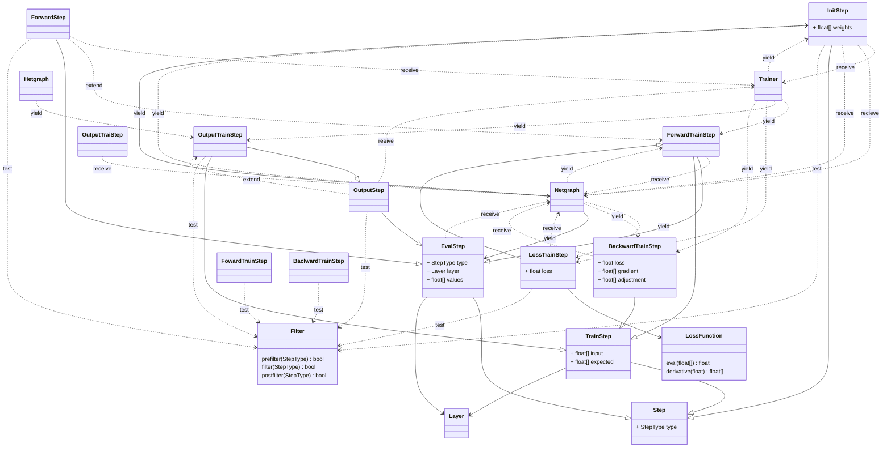

# Step-Centric View

The view of the StepResult objects and how they relate to each other and to the objects that send and recieve them.

```mermaid
classDiagram
  InitStep ..> Trainer : receive
  ForwardStep ..> Trainer : receive
  OutputStep ..> Trainer : reeive
  Trainer ..> InitStep : yield
  Trainer ..> ForwardTrainStep : yield
  Trainer ..> OutputTrainStep : yield
  Trainer ..> LossTrainStep : yield
  Trainer ..> BackwardTrainStep : yield
  InitStep ..> Netgraph : recieve
  ForwardTrainStep ..> Netgraph : receive
  OutputTraiStep ..> Netgraph : receive
  LossTrainStep ..> Netgraph : receive
  BackwardTrainStep ..> Netgraph : receive
  Netgraph ..> InitStep : yield
  Netgraph ..> ForwardTrainStep : yield
  Hetgraph ..> OutputTrainStep : yield
  Netgraph ..> LossTrainStep : yield
  Netgraph ..> BackwardTrainStep : yield
  ForwardStep ..> ForwardTrainStep: extend
  OutputStep ..> OutputTrainStep : extend
  InitStep ..> Netgraph : receive
  EvalStep ..> Netgraph : receive
  Netgraph --> InitStep : yield
  Netgraph --> EvalStep : yield
  class Step {
    + StepType type
  }
  class InitStep {
    + float[] weights
  }
  class EvalStep {
    + StepType type
    + Layer layer
    + float[] values
  }
  class ForwardStep {

  }
  class OutputStep {

  }
  class TrainStep {
    + float[] input
    + float[] expected
  }
  TrainStep --|> Step
  class ForwardTrainStep {

  }
  ForwardTrainStep --|> EvalStep
  ForwardTrainStep --|> TrainStep
  class OutputTrainStep {

  }
  OutputTrainStep --|> OutputStep
  OutputTrainStep --|> TrainStep
  class LossFunction {
    eval(float[]) float
    derivative(float) float[]
  }
  class LossTrainStep {
    + float loss
  }
  LossTrainStep --|> ForwardTrainStep
  LossTrainStep --> LossFunction
  class BackwardTrainStep {
    + float loss
    + float[] gradient
    + float[] adjustment
  }
  BackwardTrainStep --|> TrainStep
  InitStep --|> Step
  EvalStep --|> Step
  ForwardStep --|> EvalStep
  OutputStep --|> EvalStep
  EvalStep --> Layer
  TrainStep --> Layer
  class Filter {
    prefilter(StepType) bool
    filter(StepType) bool
    postfilter(StepType) bool
  }

  InitStep ..> Filter          : test
  ForwardStep ..> Filter       : test
  OutputStep ..> Filter        : test
  FowardTrainStep ..> Filter   : test
  OutputTrainStep ..> Filter   : test
  LossTrainStep ..> Filter     : test
  BaclwardTrainStep ..> Filter : test
```
