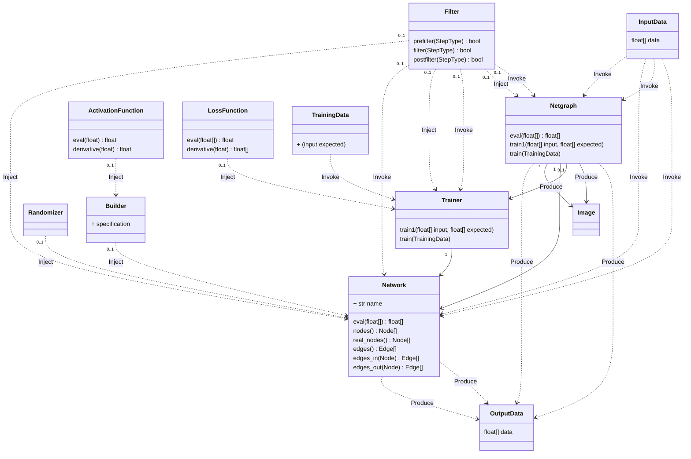

# User View

Full set of user-level objects.

```mermaid
classDiagram

  class Builder {
    + specification
  }
  class Randomizer {

  }
  class Network {
    + str name
    eval(float[]) float[]
    nodes() Node[]
    real_nodes() Node[]
    edges() Edge[]
    edges_in(Node) Edge[]
    edges_out(Node) Edge[]
  }
  class Netgraph {
    eval(float[]) float[]
    train1(float[] input, float[] expected)
    train(TrainingData)
  }
  class Filter {
    prefilter(StepType) bool
    filter(StepType) bool
    postfilter(StepType) bool
  }

  class ActivationFunction {
    eval(float) float
    derivative(float) float
  }

  class Trainer {
    train1(float[] input, float[] expected)
    train(TrainingData)
  }
  class LossFunction {
    eval(float[]) float
    derivative(float) float[]
  }

  class TrainingData {
    + (input expected)
  }

  class InputData {
    float[] data
  }

  class OutputData {
    float[] data
  }
  InputData ..> Netgraph : Invoke
  InputData ..> Network : Invoke
  Netgraph ..> OutputData : Produce
  Network ..> OutputData : Produce

  class Image {

  }
  Netgraph "*" --> Image : Produce

  Builder "0..1" ..> Network : Inject
  Randomizer "0..1" ..> Network : Inject
  ActivationFunction "0..1" ..> Builder : Inject
  Filter "0..1" ..> Network : Inject
  Filter "0..1" ..> Network : Invoke
  Trainer "1" --> Network
  LossFunction "0..1" ..> Trainer : Inject
  Filter "0..1" ..> Trainer : Inject
  Filter "0..1" ..> Trainer : Invoke
  Netgraph "1" --> Network
  Filter "0..1" ..> Netgraph : Inject
  Filter "0..1" ..> Netgraph : Invoke
  Netgraph "0..1" --> Trainer
  TrainingData ..> Trainer : Invoke

  Netgraph --> Image : Produce
  InputData ..> Netgraph : Invoke
  InputData ..> Network : Invoke
  Netgraph ..> OutputData : Produce
  Network ..> OutputData : Produce
```
